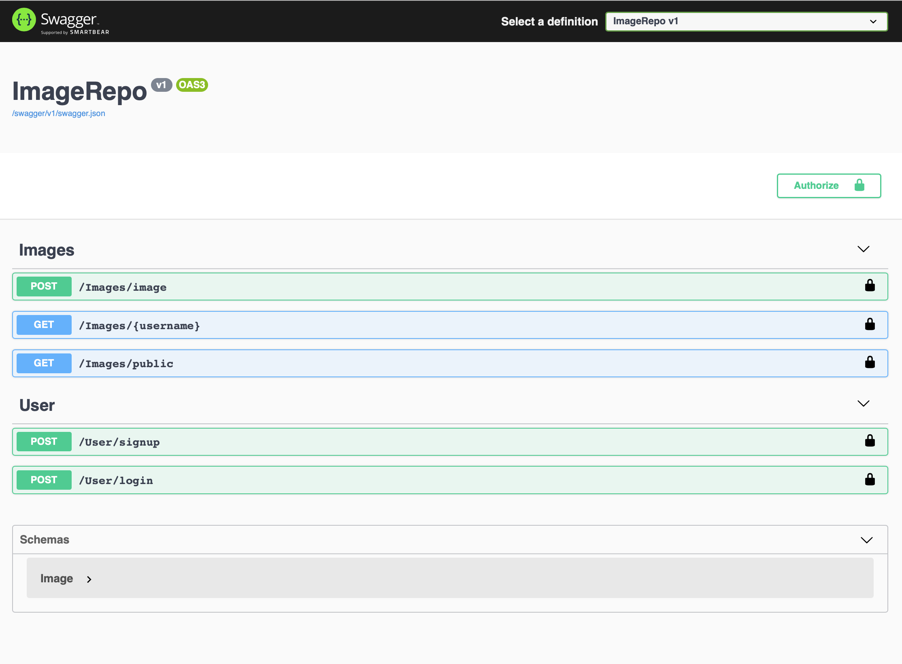

# Image Repository

Image Repository API that captures the following use cases from the Shopify developer [challenge](https://docs.google.com/document/d/1ZKRywXQLZWOqVOHC4JkF3LqdpO3Llpfk_CkZPR8bjak/edit):

- ADD image(s) to the repository
    - upload a single image at a time
    - private or public (permissions)
    - secure uploading and stored images

# Design

Some interesting things I explored while building this API:

1. Use Entity Framework Core for persistence
2. Implement **Unit of Work** and **Repository** design patterns
3. Use JSON Web Tokens for endpoint authorization
4. Setup Swagger to have a friendly api interface

# Run

Make sure you have .NET 5. You can download it [here](https://dotnet.microsoft.com/download). 

### Clone the repo

```jsx
git clone https://github.com/yaseribrahim/ImageRepository.git
```

### Run the project

```jsx
dotnet run
```

The Swagger UI webpage at [https://localhost:5001](https://localhost:5001) should open 



To make requests with authorization headers

1. Get JWT by signing up/logging in
2. Hit Authorize Button and enter token

# Notes

I wrote a blog post while working on this project: [https://yaseribrahim.medium.com/simple-jwt-authentication-with-swagger-for-net-web-api-35595c151c7c](https://yaseribrahim.medium.com/simple-jwt-authentication-with-swagger-for-net-web-api-35595c151c7c)